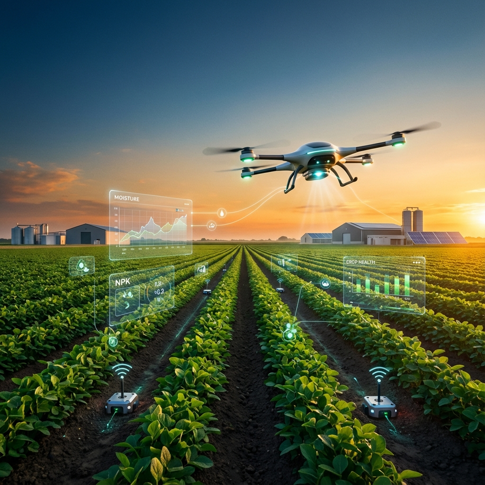
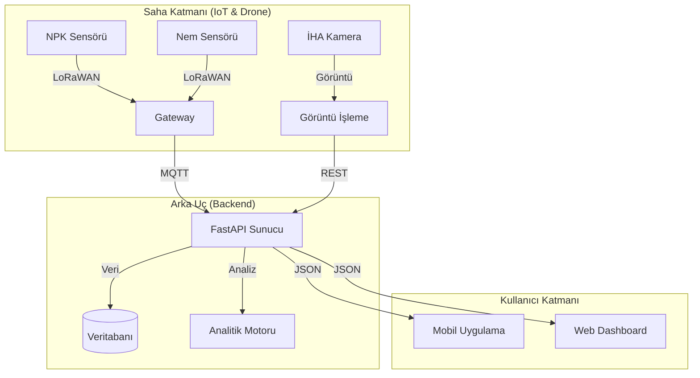



# 🌾 TEKNOFEST Tarım Teknolojileri - Akıllı Tarım Çözümleri

## 🔍 Kapsamlı Araştırma ve Rakip Analizi

Bu proje geliştirilmeden önce, tarım teknolojileri (AgriTech) alanındaki ulusal ve uluslararası ekosistem derinlemesine incelenmiştir. Aşağıda, benchmark alınan yarışmalar ve açık kaynaklı projeler yer almaktadır.

### 🏆 Benzer Yarışmalar (Uluslararası & Ulusal)

| Yarışma Adı | Odak Noktası | Önemli Çıktılar |
| :--- | :--- | :--- |
| **TEKNOFEST Tarım Teknolojileri** | Sürdürülebilirlik, Verimlilik, Otonom Sistemler | Türkiye'nin en büyük havacılık ve teknoloji festivali. |
| **AgBOT Challenge** | Otonom Ekim, Yabancı Ot Kontrolü, Toprak Analizi | Purdue Üniversitesi ve Gerrish Farms tarafından düzenlenen küresel yarışma. |
| **Farm Robotics Challenge** | Robotik, AI, İşgücü Otomasyonu | UC Davis destekli, öğrenci odaklı robotik çözümleri. |
| **ASABE Student Design** | Tarımsal Mühendislik ve Tasarım | Stand sayımı, hassas bahçecilik ve otonom traktör tasarımı. |
| **FAO Global AgriInno** | Genç Girişimcilik ve İnovasyon | Birleşmiş Milletler (FAO) tarafından desteklenen küresel tarım çözümleri. |

### 💻 İlham Alınan Açık Kaynak Kaynak Kodlar & Projeler

Aşağıdaki projeler, bu çalışmanın mimari ve teknik altyapısına ışık tutmuştur:

- **[FarmBot](https://github.com/FarmBot):** Dünyanın ilk açık kaynaklı hassas tarım robotu ve işletim sistemi.
- **[ROS Agriculture](https://github.com/ros-agriculture):** Robot İşletim Sistemi (ROS) kullanarak çiftçilere robotik araçlar sunan topluluk.
- **[Open Source Ecology](https://github.com/OpenSourceEcology):** Global Köy İnşaat Seti (GVCS) kapsamında açık kaynak donanım tasarımları.
- **[farmOS](https://github.com/farmOS/farmOS):** Çiftlik yönetimi, planlama ve kayıt tutma için web tabanlı uygulama.
- **[OpenWeedLocator (OWL)](https://github.com/OpenWeedLocator/OWL):** Görüntü işleme tabanlı, düşük maliyetli yabancı ot tespit sistemi.
- **[Raster Vision](https://github.com/azavea/raster-vision):** Uydu ve drone görüntüleri üzerinde derin öğrenme uygulamaları için framework.

### 📊 Rakip Analizi & Stratejik Konumlandırma

| Özellik | Mevcut Çözümler | Bizim Projemiz (Smart Ag) |
| :--- | :--- | :--- |
| **Erişilebilirlik** | Genellikle yüksek maliyetli kurumsal yazılımlar | Açık kaynak ve düşük maliyetli donanım uyumluluğu |
| **Teknoloji** | Kapalı devre sistemler, sınırlı entegrasyon | Modüler mimari, ROS ve AI odaklı esneklik |
| **Veri Analitiği** | Temel sensör verisi izleme | Derin öğrenme tabanlı bitki sağlığı ve rekolte tahmini |
| **Kullanılabilirlik** | Teknik bilgi gerektiren karmaşık arayüzler | Minimalist, kullanıcı dostu dashboard ve mobil destek |

---

# 🌾 Teknofest Smart Agriculture (Tarımsal İHA & IoT)


## 🚀 Proje Vizyonu

**Teknofest Tarım Teknolojileri**, modern tarımda verimliliği artırmak ve kaynak israfını önlemek amacıyla geliştirilmiş bütünleşik bir **Yapay Zeka (AI)** ve **Nesnelerin İnterneti (IoT)** çözümüdür. Projemiz, tarımsal alanları otonom İHA'lar ile tarayarak hastalıkları erken teşhis eder ve yerel sensör ağları ile toprak sağlığını anlık olarak izler.

Hedefimiz, geleneksel tarım yöntemlerini modern teknoloji katmanlarıyla birleştirerek sürdürülebilir bir gelecek inşa etmektir.

---

## 🏗️ Sistem Mimarisi

Sistemimiz üç ana katmandan oluşur: **Saha Sensörleri (Edge)**, **Veri İşleme (Cloud/Backend)** ve **Kullanıcı Arayüzü**.



## ✨ Temel Özellikler

- **🌱 Akıllı Hastalık Tespiti:** CNN tabanlı derin öğrenme modelleri ile bitki hastalıklarını %95+ doğrulukla tespit eder.
- **📡 LoRaWAN Entegrasyonu:** Uzun menzilli ve düşük güç tüketimli sensör ağları ile geniş arazilerde kesintisiz veri akışı.
- **💧 Hassas Sulama:** Toprak nem verilerine göre otomatik sulama önerileri.
- **� Gerçek Zamanlı Analitik:** NPK değerleri ve bitki sağlığı haritaları.

## �️ Kurulum

Projeyi yerel ortamınızda çalıştırmak için aşağıdaki adımları izleyin.

### Gereksinimler
- Python 3.8+
- Git

### Adım Adım Kurulum

1. **Repoyu Klonlayın:**
   ```bash
   git clone https://github.com/bahattinyunus/teknofest_tarim_teknolojileri.git
   cd teknofest_tarim_teknolojileri
   ```

2. **Sanal Ortam Oluşturun (Önerilen):**
   ```bash
   python -m venv venv
   # Windows:
   .\venv\Scripts\activate
   # Linux/Mac:
   source venv/bin/activate
   ```

3. **Bağımlılıkları Yükleyin:**
   ```bash
   pip install -r requirements.txt
   ```

## � Kullanım / Demo

### 1. Sensör Simülasyonu
Sensör verilerini simüle etmek için doğrudan Python modülünü kullanabilirsiniz:

```python
from src.sensor_node import NPKSensor

sensor = NPKSensor(node_id="FIELD-01", location=(40.1, 29.5))
print(sensor.read_data())
# Çıktı: {'N': 45, 'P': 32, 'K': 180}
```

### 2. Hastalık Tespiti
Hastalık tespit modülünü test etmek için:

```python
from src.disease_detector import PlantDiseaseDetector

detector = PlantDiseaseDetector()
result = detector.detect(image=np.zeros((100,100))) # Dummy image
print(result)
```

## 🧪 Testler

Sistemin kararlılığını doğrulamak için birim testleri çalıştırın:

```bash
pytest tests/
```

## 🤝 Katkıda Bulunma

Her türlü katkıya açığız! Lütfen `CONTRIBUTING.md` dosyasını inceleyin.

1. Forklayın
2. Feature branch oluşturun (`git checkout -b feature/yenilik`)
3. Commit atın (`git commit -m 'Yeni özellik eklendi'`)
4. Pushlayın (`git push origin feature/yenilik`)
5. Pull Request gönderin

---

## 👨‍💻 Geliştirici & İletişim

**Bahattin Yunus Çetin**  
*IT Architect & Student @ Trabzon Of*

Bu proje, modern tarım teknolojileri üzerine vizyoner bir yaklaşım sergilemek amacıyla geliştirilmiştir.

<div align="center">

[](https://www.linkedin.com/in/bahattinyunus/)
[](https://github.com/bahattinyunus)

</div>

---

<p align="center">
  &copy; 2025 Teknofest Tarım Teknolojileri. Tüm hakları saklıdır.
</p>